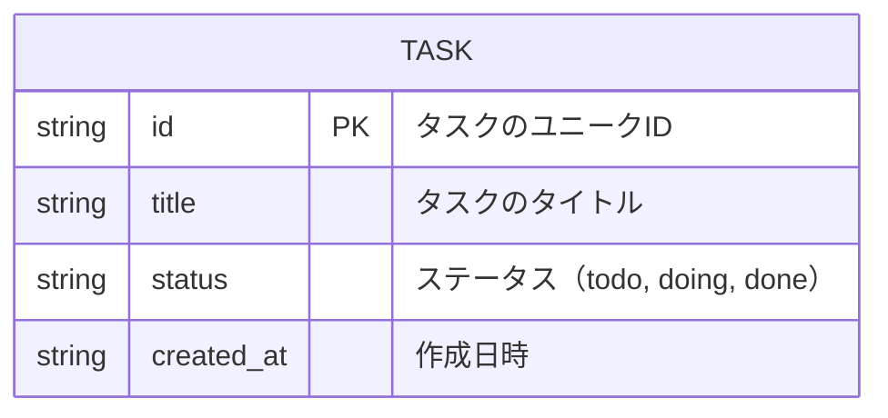

# データ構造

## データベース設計

### ER図



### フィールド説明

| フィールド | 型 | 説明 |
|-----------|-----|------|
| **id** | string | タスクを識別するユニークID（タイムスタンプやUUIDを使用） |
| **title** | string | タスクのタイトル（ユーザーが入力したテキスト） |
| **status** | string | タスクの現在の状態<br/>- `todo`: やることリスト<br/>- `doing`: 進行中<br/>- `done`: 完了 |
| **created_at** | string | タスク作成時の日時（ISO形式） |

---

## ローカルストレージの保存形式

```javascript
// ローカルストレージに保存される形式の例
{
  "tasks": [
    {
      "id": "1234567890",
      "title": "買い物に行く",
      "status": "todo",
      "created_at": "2026-05-28T10:30:00Z"
    },
    {
      "id": "1234567891",
      "title": "レポートを提出する",
      "status": "doing",
      "created_at": "2026-05-28T10:35:00Z"
    },
    {
      "id": "1234567892",
      "title": "プレゼンの準備",
      "status": "done",
      "created_at": "2026-05-28T10:40:00Z"
    }
  ]
}
```
