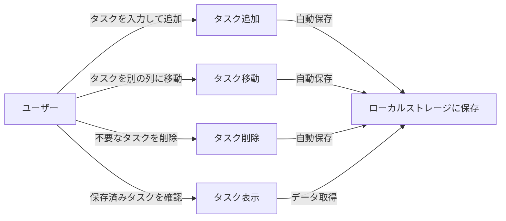
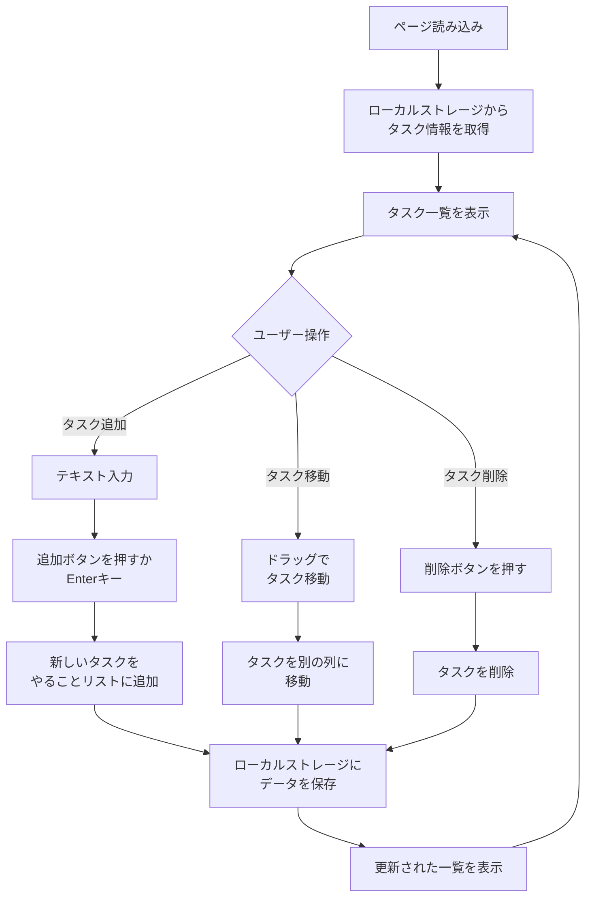

# 画面設計・ユースケース

## ユースケース図



## ユースケース説明

| ユースケース | アクター | 説明 | 前提条件 | 結果 |
|-------------|---------|------|--------|------|
| **タスク追加** | ユーザー | テキスト入力欄にタスクを入力し、ボタンをクリックまたはEnterキーで追加 | ページが表示されている | 新しいタスクが「やることリスト」に追加される |
| **タスク表示** | ユーザー | ページを開くと、保存済みのタスク一覧が3つの列に表示される | ブラウザのローカルストレージにデータがある | 過去に作成したタスクが表示される |
| **タスク移動** | ユーザー | タスクをドラッグして別の列（進行中、完了）にドロップで移動 | タスクが存在している | タスクが選択した列に移動される |
| **タスク削除** | ユーザー | タスクカードの削除ボタンをクリック | タスクが存在している | タスクが削除される |

---

## 画面構成（ワイヤーフレーム）

```
┌─────────────────────────────────────────────┐
│      タスク管理アプリ                         │
├─────────────────────────────────────────────┤
│ [タスクを入力] [追加ボタン]                  │
├─────────────────────────────────────────────┤
│ やることリスト │ 進行中 │ 完了              │
├────────────┼───────────┼─────────────┤
│ ┌────────┐ │┌────────┐ │┌────────────┐│
│ │タスク1 │ ││タスク3 │ ││ タスク5    ││
│ │[削除]  │ ││[削除]  │ ││  [削除]    ││
│ └────────┘ │└────────┘ │└────────────┘│
│ ┌────────┐ │           │┌────────────┐│
│ │タスク2 │ │           ││ タスク4    ││
│ │[削除]  │ │           ││  [削除]    ││
│ └────────┘ │           │└────────────┘│
└────────────┴───────────┴─────────────┘
```

## 画面要素の説明

| 要素 | 説明 |
|------|------|
| **入力欄** | タスクのタイトルを入力 |
| **追加ボタン** | 入力したタスクを「やることリスト」に追加 |
| **3つの列** | タスクの状態を3つに分類（やることリスト、進行中、完了） |
| **タスクカード** | タスク情報を表示（タイトル、削除ボタン） |
| **削除ボタン** | タスクを削除 |

---

## 画面遷移フロー


